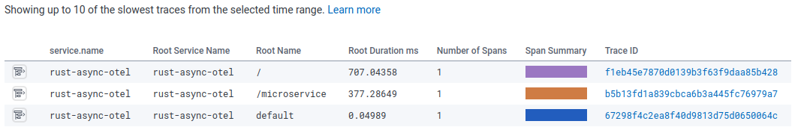
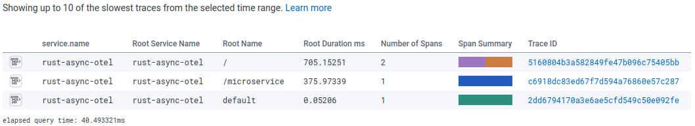
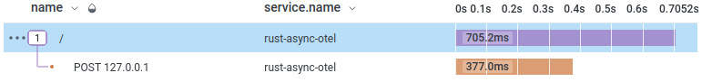
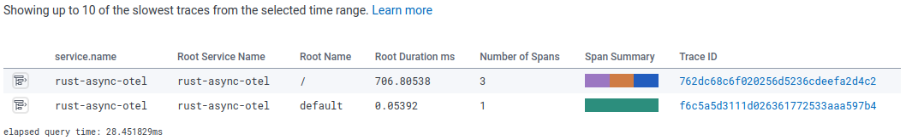
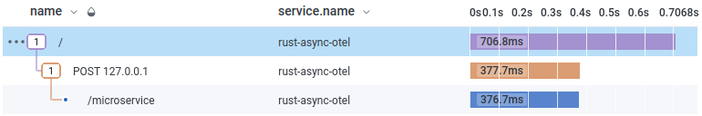
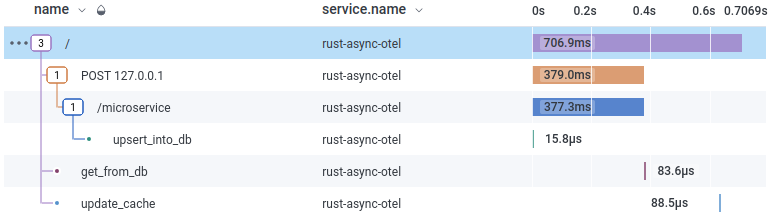
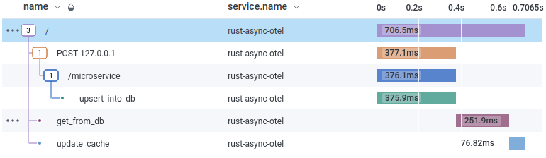
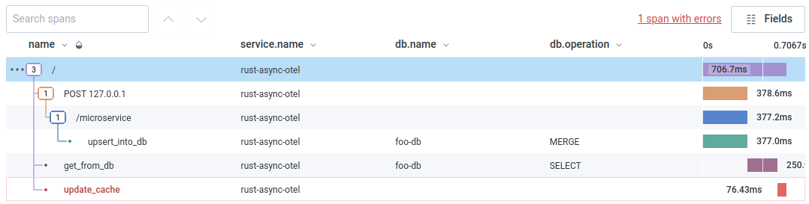

# OTel in async Rust 🦀
Simple example web app using [actix-web](https://docs.rs/actix-web/latest/actix_web/index.html)

```rust
use actix_web::{get, App, HttpServer, Responder};

#[get("/")]
async fn greet() -> impl Responder {
    "Hello World!"
}

#[actix_web::main]
async fn main() -> std::io::Result<()> {
    HttpServer::new(|| {
        App::new().service(greet)
    })
    .bind(("127.0.0.1", 8080))?
    .run()
    .await
}
```

----------

Add some “time wasters”

```rust
#[get("/")]
async fn greet() -> impl Responder {
    get_from_db().await;
    update_cache().await;
    "Hello World!"
}

async fn get_from_db() -> () {
    sleep(Duration::from_millis(250)).await;
}

async fn update_cache() -> () {
    sleep(Duration::from_millis(75)).await;
}
```

----------

Adding a sub-request

```shell
cargo add awc
```

```rust
#[post("/")]
async fn greet() -> impl Responder {
    let _ms_resp = awc::Client::default()
        .post("http://127.0.0.1:8080/microservice")
        .send()
        .await
        .expect("requesting sub-service")
        .body()
        .await
        .expect("reading response from sub-service");
/* [...] */
}
```

```rust
#[post("/microservice")]
async fn microservice() -> impl Responder {
    upsert_into_db().await;
    "Hello microservice!"
}
async fn upsert_into_db() -> () {
    sleep(Duration::from_millis(375)).await;
}
```

----------

```shell
$ curl -sv '127.0.0.1:8080'
+   Trying 127.0.0.1:8080...
+ Connected to 127.0.0.1 (127.0.0.1) port 8080 (#0)
    > GET / HTTP/1.1
    > Host: 127.0.0.1:8080
    > User-Agent: curl/7.86.0
    > Accept: */*
    > 
+ Mark bundle as not supporting multiuse
< HTTP/1.1 200 OK
< content-length: 12
< content-type: text/plain; charset=utf-8
< date: Wed, 07 Dec 2022 02:01:21 GMT
< 
+ Connection #0 to host 127.0.0.1 left intact
Hello World!
```

----------

Adding OpenTelemetry traces pipeline

```shell
cargo add opentelemetry --features=rt-tokio-current-thread
cargo add opentelemetry_otlp
cargo add tonic
```

----------

```rust
fn setup_tracing() -> () {
    // prepare gRPC metadata (HTTP headers) with our honeycomb key
    let mut headers = tonic::metadata::MetadataMap::with_capacity(1);
    headers.insert(
        "x-honeycomb-team",
        std::env::var("HONEYCOMB_TOKEN")
            .expect("retreiving HONEYCOMB_TOKEN")
            .parse()
            .expect("parsing HONEYCOMB_TOKEN"),
    );
```

----------
```rust
// create a gRPC OTLP exporter
let tracing_exporter = opentelemetry_otlp::new_exporter()
    .tonic() // gRPC
    .with_endpoint("https://api.honeycomb.io")
    .with_metadata(headers);
```
----------
```rust
// setup the otlp pipeline with batching and sampler
opentelemetry_otlp::new_pipeline()
    .tracing()
    .with_exporter(tracing_exporter)
    .with_trace_config(
        opentelemetry::sdk::trace::config()
            .with_sampler(Sampler::AlwaysOn)
            .with_resource(Resource::new(vec![
                KeyValue::new("service.name", env!("CARGO_PKG_NAME")),
                KeyValue::new("service.version", env!("CARGO_PKG_VERSION")),
            ])),
    )
    .install_batch(opentelemetry::runtime::TokioCurrentThread)
    .expect("tracing pipeline installation");
}
```
----------
```rust
#[actix_web::main]
async fn main() -> std::io::Result<()> {
    setup_tracing(); // <- set it up
    HttpServer::new(|| App::new().service(greet).service(microservice))
        .bind(("127.0.0.1", 8080))?
        .run()
        .await
}
```
----------

TLS verification issue

```shell
$ cargo run
    Finished dev [unoptimized + debuginfo] target(s) in 0.10s
     Running `target/debug/rust-async-otel`
# sending a request to the server, then:
OpenTelemetry trace error occurred. Exporter otlp encountered the following error(s): the grpc server returns error (Unknown error): , detailed error message: transport error
```
----------

Fix
```shell
cargo add opentelemetry_otlp --features=tls-roots
```
----------

Tonic, the gRPC framework we’re using, doesn’t support TLS by default. It has to be enabled via a feature toggle.

`opentelemetry-otlp` has feature flags to enable features in `tonic`
[`Cargo.toml`](https://github.com/open-telemetry/opentelemetry-rust/blob/44b90202fd744598db8b0ace5b8f0bad7ec45658/opentelemetry-otlp/Cargo.toml#L70-L73):

```toml
# grpc using tonic
grpc-tonic = ["tonic", "prost", "http", "tokio", "opentelemetry-proto/gen-tonic"]
tls = ["tonic/tls"]
tls-roots = ["tls", "tonic/tls-roots"]
```

The [tonic documentation](https://docs.rs/tonic/0.8.3/tonic/) says about `tls-roots`:

> `tls-roots`: Adds system trust roots to `rustls`-based gRPC clients using the `rustls-native-certs` crate. Not enabled by default. `tls` must be enabled to use `tls-roots`.

Without `tls-roots`, there are no Certificate Authorities that are trusted by your code. By enabling the feature, tonic will use your systems trust store (`/etc/ca-certificates/`).

----------

OTel pipeline, but not traces 😞 

----------
```shell
cargo add actix-web-opentelemetry
```

```rust
#[actix_web::main]
async fn main() -> std::io::Result<()> {
    setup_tracing();
    HttpServer::new(|| {
        App::new()
            .wrap(actix_web_opentelemetry::RequestTracing::new()) // <- middleware
            .service(greet)
            .service(microservice)
    })
    .bind(("127.0.0.1", 8080))?
    .run()
    .await
}
```
----------


----------

Enable feature for client tracing (`actix-web-client=awc`)

```shell
cargo add actix-web-opentelemetry --features=awc
```
----------
```rust
use actix_web_opentelemetry::ClientExt;

#[get("/")]
async fn greet() -> impl Responder {
    let _ms_resp = awc::Client::default()
        .post("http://127.0.0.1:8080/microservice")
        .trace_request() // <- add tracing instrumentation
        .send()
        .await
        .expect("requesting sub-service")
        .body()
        .await
        .expect("reading response from sub-service");
// [...]
```
----------


----------


----------

*distributed* tracing

How do we connect these traces?

----------

Add propagator

```rust
// in setup_tracing():
    // add propagation to connect spans with remote systems
    opentelemetry::global::set_text_map_propagator(
        opentelemetry::sdk::propagation::TraceContextPropagator::new(),
    );
```
----------

Use upstream sampling decision

```rust
// in setup_tracing():
    opentelemetry_otlp::new_pipeline()
        .tracing()
        .with_exporter(tracing_exporter)
        .with_trace_config(
            opentelemetry::sdk::trace::config()
                .with_sampler(Sampler::ParentBased(std::boxed::Box::new( // +
                    Sampler::AlwaysOn,                                   // +
                )))                                                      // +
                // was: .with_sampler(Sampler::AlwaysOn)
```
----------


----------


----------

Still lots of empty space.

What about our sleeps?

----------
```rust
async fn get_from_db() -> () {
    let _span_guard = mark_span_as_active(tracer("mainservice").start("get_from_db"));
    sleep(Duration::from_millis(250)).await;
}
async fn update_cache() -> () {
    let _span_guard = mark_span_as_active(tracer("mainservice").start("update_cache"));
    sleep(Duration::from_millis(75)).await;
}
async fn upsert_into_db() -> () {
    let _span_guard = mark_span_as_active(tracer("microservice").start("upsert_into_db"));
    sleep(Duration::from_millis(375)).await;
}
```
----------


----------

15 µs?

What happened to `sleep(Duration::from_millis(375))`?

----------

async Rust caused this

----------
```rust
use opentelemetry::{
    global::tracer,
    sdk::{trace::Sampler, Resource},
    trace::{mark_span_as_active, Tracer},
    trace::{mark_span_as_active, FutureExt, Tracer}, // <- FutereExt
    KeyValue,
};
```
----------
```rust
    get_from_db().with_current_context().await;
    update_cache().with_current_context().await;
// [...]
    sleep(Duration::from_millis(250)).with_current_context().await;
// [...]
    sleep(Duration::from_millis(75)).with_current_context().await;
// [...]
    upsert_into_db().with_current_context().await;
// [...]
    sleep(Duration::from_millis(375)).with_current_context().await;
```
----------


----------

Adding more details

----------
```rust
// in get_from_db()
    get_active_span(|span| {
        span.set_status(opentelemetry::trace::Status::Ok);
        span.set_attribute(KeyValue::new("db.name", "foo-db"));
        span.set_attribute(KeyValue::new("db.operation", "SELECT"));
    });
```
----------
```rust
// in update_cache()
    get_active_span(|span| {
        span.set_status(opentelemetry::trace::Status::Error {
            description: "caching service offline".into(),
        })
    });
```
----------
```rust
// in upsert_into_db()
    get_active_span(|span| {
        span.set_status(opentelemetry::trace::Status::Ok);
        span.set_attribute(KeyValue::new("db.name", "foo-db"));
        span.set_attribute(KeyValue::new("db.operation", "MERGE"));
    });
```
----------

